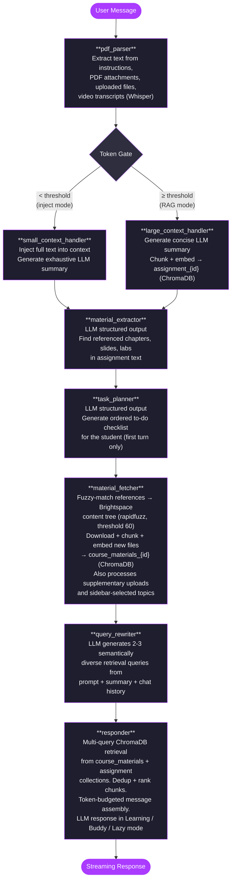

# TruStudy - Agent Architecture

TruStudy uses a **LangGraph StateGraph** pipeline to process university assignments and answer student questions with grounded, RAG-backed responses. Every chat message flows through the full pipeline; nodes skip work when results are already cached from a prior turn.

---

## Pipeline Diagram

---

## Shared State

All nodes read from and write to a single `GraphState` TypedDict. LangGraph merges each node's returned dict into the shared state - nodes only return the keys they modify.

Key state fields:

| Field | Set by | Used by |
|---|---|---|
| `assignment_text` | `pdf_parser` | `context_handler`, `material_extractor` |
| `assignment_summary` | `context_handler` | `task_planner`, `query_rewriter`, `responder` |
| `context_mode` (`inject`/`rag`) | `context_handler` | `responder` |
| `material_references` | `material_extractor` | `material_fetcher` |
| `task_plan` | `task_planner` | cached in session, returned to frontend |
| `supplementary_uploads` | `pdf_parser` | `material_fetcher` |
| `user_selected_topics` | request input | `material_fetcher` |
| `embedded_materials` | `material_fetcher` | cached in session |
| `effective_course_id` | `material_fetcher` | `responder` |
| `retrieval_queries` | `query_rewriter` | `responder` |
| `response` | `responder` | returned to frontend |

---

## Multi-Turn Caching

On the first message for an assignment, the full pipeline runs. Expensive results are persisted in a JSON session file (`storage/sessions/{session_id}.json`):

- `assignment_text`, `assignment_summary`, `assignment_token_count`, `context_mode`
- `material_references`, `embedded_materials`
- `task_plan`

On subsequent turns, `pdf_parser` and `context_handler` detect the cached summary and skip extraction and embedding entirely. `material_fetcher` skips re-downloading already-embedded materials (deduped by manifest + ChromaDB metadata).

`uploaded_files` and `supplementary_uploads` are **not** cached - they are re-derived from the request on every turn so uploads are always current.

---

## ChromaDB Collections

| Collection | Contains | Queried by |
|---|---|---|
| `assignment_{id}` | Chunked assignment text (RAG mode only) | `responder` |
| `course_materials_{course_id}` | Course files, selected topics, supplementary uploads | `responder` |
| `course_materials_0` | Freeform uploads (no assignment selected) | `responder` |

> **Gotcha:** `effective_course_id = 0` for freeform mode. All guards must use `is not None` checks - `if course_id:` treats 0 as falsy and silently skips retrieval.

---

## Response Modes

The `responder` node switches system prompts based on the `mode` field in the request:

| Mode | Behavior |
|---|---|
| `learning` | Socratic - asks what the student already knows, nudges rather than answers |
| `neutral` (Buddy) | Helpful and conversational, occasionally checks understanding |
| `lazy` | Gives the answer directly with minimal explanation |
